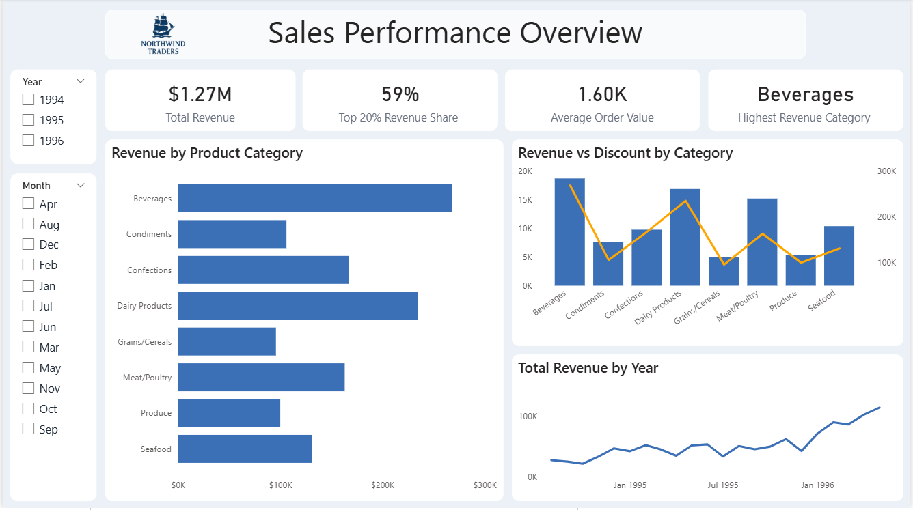
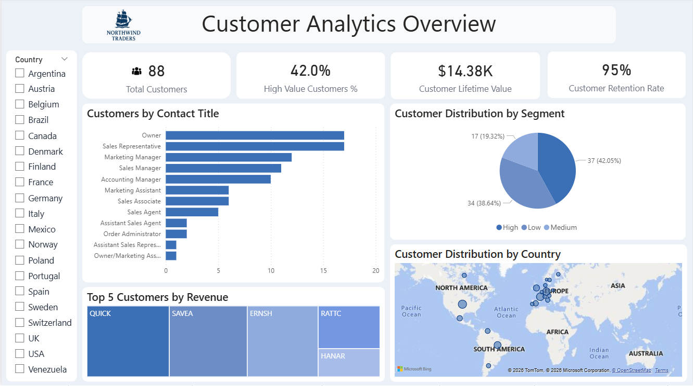
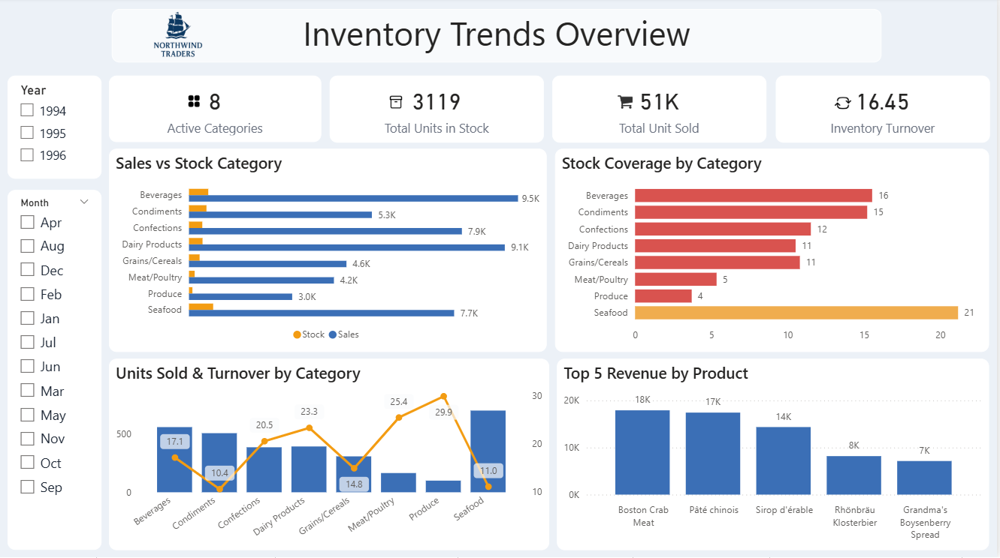
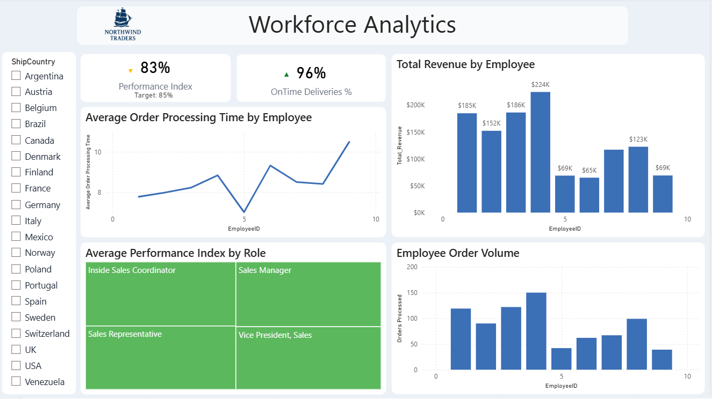
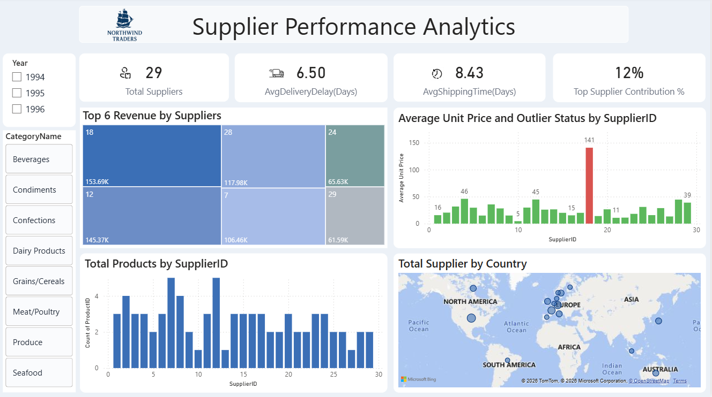

# Northwind Traders – End-to-End Data Analytics & Power BI Dashboard

## 📌 Project Overview conclusion

Northwind Traders is a fictional wholesale organization that imports and exports specialty food products across international markets.

This project demonstrates an end-to-end data analytics workflow, transforming raw Northwind transactional data into interactive Power BI dashboards for business analysis and decision-making.

The project focuses on:

- Sales Performance
- Customer Behavior
- Inventory Trends
- Employee Productivity
- Supplier Contributions

---

## 🎯 Project Objective

The objective of this project is to build a visually appealing, interactive, and user-friendly Power BI report that provides meaningful insights into Northwind Traders' business performance.

The dashboards enable stakeholders to:

- Monitor business performance
- Identify sales and customer trends
- Analyze inventory and product movement
- Evaluate employee productivity
- Understand supplier contributions
- Explore data using interactive filters and slicers

---

## 🗂️ Dataset

The Northwind Traders dataset represents the operational and sales data of a fictional wholesale company.

### Tables Used

- Customers
- Employees
- Orders
- Order Details
- Products
- Suppliers
- Shippers
- Categories

These tables are connected through primary and foreign key relationships, enabling integrated analysis across different business areas.

---

## 🛠️ Tools & Technologies

- **MySQL Workbench** – SQL analysis and data exploration
- **Microsoft Excel** – Initial data handling
- **Power Query** – Data cleaning and transformation
- **Power BI** – Data modeling, visualization, and dashboard development

---

## 🔄 Project Workflow

1. Data collection from CSV files
2. Data import into Power BI
3. Data cleaning and transformation using Power Query
4. Data validation and consistency checks
5. Data modeling using table relationships
6. Dashboard design and visualization
7. Business insight generation and interpretation

---

## 🧹 Data Cleaning & Transformation

Data preparation was performed using Power Query.

### Cleaning Activities

- Replaced missing **Region** and **Fax** values with `"Unknown"` where applicable
- Removed the unnecessary **Picture** column from Categories
- Removed **Photo** and **Notes** columns from Employees
- Removed **Homepage** from Suppliers
- Removed rows containing approximately 1–3% missing values where appropriate
- Corrected incorrect date and data types
- Standardized the dataset for analysis and visualization

### Data Validation

- Compared row counts before and after cleaning
- Verified relationships between tables
- Validated numerical fields
- Validated date fields
- Checked overall data consistency

---

# 📊 Power BI Dashboards

## 1. Sales Performance Overview



Provides a high-level view of sales performance, revenue, orders, monthly revenue trends, and country-level performance.

### Key Analysis

- Total Revenue
- Total Orders
- Monthly Revenue Trends
- Revenue by Country
- Revenue by Product Category
- Top-Performing Countries
- Sales Performance Trends

---

## 2. Customer Analytics Overview



Analyzes customer behavior and geographic distribution to understand customer contribution and regional sales patterns.

### Key Analysis

- Customer Distribution
- Customer Segmentation
- Customer Geographic Distribution
- Customer Revenue Contribution
- Customer Order Patterns
- Regional Customer Analysis

---

## 3. Inventory Trends Overview



Monitors product inventory and sales patterns to support inventory planning and stock management.

### Key Analysis

- Product Stock Levels
- Units Sold
- Inventory Trends
- Inventory Turnover
- Product Sales Patterns
- High-Demand Products
- Category-Level Inventory Analysis

---

## 4. Workforce Analytics



Evaluates employee productivity and operational contribution by analyzing employee order handling and performance.

### Key Analysis

- Employee Order Handling
- Employee Productivity
- Orders by Employee
- Employee Contribution
- Employee Performance Analysis
- Workforce Distribution

---

## 5. Supplier Performance Analytics



Analyzes supplier contributions and product supply patterns to understand supplier dependency and product availability.

### Key Analysis

- Supplier Contribution
- Supplier Distribution
- Products by Supplier
- Supplier Geographic Distribution
- Supplier Product Supply
- Supplier Performance Analysis

---

# 📈 Key Business Insights

### 🌎 Revenue Concentration by Country

The United States and Germany generate a significant portion of total revenue, highlighting their importance to overall business performance.

### 🥤 Top-Performing Product Categories

Beverages and Dairy Products contribute a large share of sales, making these categories important areas for inventory management and sales analysis.

### 👥 Customer Revenue Distribution

A relatively small group of customers contributes a large percentage of total sales, highlighting the importance of understanding high-value customer behavior.

### 👨‍💼 Employee Productivity Differences

Employees handle different numbers of orders, providing useful insights into workforce productivity and operational efficiency.

### 🚚 Supplier Dependency

A limited number of suppliers provide a large proportion of products. Understanding supplier contribution can help monitor supplier dependency and potential supply-chain risks.

---

# 📊 SQL Analysis

SQL analysis was performed using MySQL Workbench to explore business questions across customers, products, orders, employees, and suppliers.

### Customer Analysis

- Average orders per customer
- High-value repeat customers
- Customer order patterns by city and country
- Customer spending and order frequency
- Preferred product categories
- Customer frequency segmentation

### Product & Sales Analysis

- Revenue by category
- Revenue by product
- Country and category performance
- Product price bands
- Stock versus sales analysis
- Seasonal demand
- Monthly sales anomalies

### Employee Analysis

- Employee geographic distribution
- Employee title distribution
- Employee hiring trends
- Employee courtesy-title distribution

### Supplier Analysis

- Supplier geographic distribution
- Supplier distribution by category
- Supplier pricing
- Supplier categories by region

---

# 💡 Business Value

This project demonstrates how raw transactional data can be transformed into actionable business insights through:

**Data → Cleaning → Validation → SQL Analysis → Data Modeling → Power BI → Business Insights**

The final dashboards provide stakeholders with an interactive way to monitor business performance, identify trends, analyze operational areas, and support data-driven decision-making.

---

# 📁 Project Structure

```text
northwind_business_intelligence_analysis/
│
├── 01_dataset/
│   ├── categories.csv
│   ├── customers.csv
│   ├── employees.csv
│   ├── order_details.csv
│   ├── orders.csv
│   ├── products.csv
│   ├── shippers.csv
│   └── suppliers.csv
│
├── 02_MECE_breakdown/
│   ├── Northwind_PowerBI_Dashboard_Documentation.docx
│   
│
├── 03_sql_scripts/
│   ├── northwind_eda_queries.sql
│   
│
├── 04_excel_analysis/
│   ├── northwind_traders_excel_analysis.xlsx
│   
│
├── 05_powerbi_report/
│   ├── northwind_sales_analysis_report.pbix
│   
│
├── 06_executive_dashboard/
│   ├── Northwind_Traders_Executive_Dashboard_Report.pbix
│   
│
├── 07_project_presentation/
│   ├── northwind_sales_analysis_presentation.pptx
│   
│
├── screenshots/
│   ├── sales-performance-overview.png
│   ├── customer-analytics-overview.png
│   ├── inventory-trends-overview.png
│   ├── workforce-analytics.png
│   └── supplier-performance-analytics.png
│
└── README.md

---

# 💡 Skills Demonstrated

- SQL
- MySQL Workbench
- Exploratory Data Analysis
- Excel
- Power Query
- Power BI
- DAX
- Data Cleaning
- Data Transformation
- Data Modeling
- KPI Development
- Data Visualization
- Business Intelligence
- Business Analysis

---

# 👩‍💻 Author

**Jevaneswari K**

**Data Analytics | SQL | Excel | Power BI**
